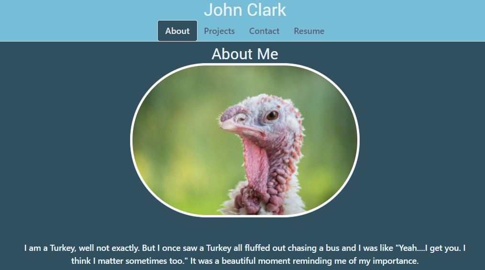

# React Portfolio

## Table of Contents

- [Usage](#usage)
- [Questions](#questions)

## Description

This is a reworking of the original portfolio page we made early on in class. This time we designed from the ground up to react and included links to several of our projects.

## Usage

To use this page simply click on the <a href="https://johnknee3.github.io/React-Portfolio/">GitPages link here</a>.

## Questions

<a href="https://github.com/JohnKnee3">JohnKnee3's GitHub</a>

If you want to contact me please send me an email at john.a.clark3@yahoo.com and I will get back to you as soon as possible.
